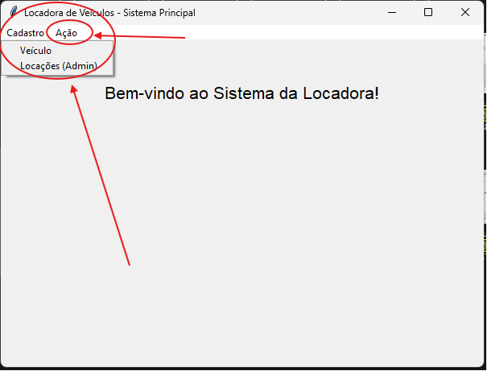

# Locadora de Veículos - LPOFactory (Padrão MVC)

Este projeto implementa o sistema de uma Locadora de Veículos utilizando a linguagem Python, a interface gráfica Tkinter e o banco de dados PostgreSQL. A arquitetura segue o padrão **MVC (Model-View-Controller)** para separar as responsabilidades, com acesso aos dados via padrão **DAO (Data Access Object)**.

## Funcionalidades Implementadas (Atividade EAD - 11/05/2026)

- **Menu Principal:** Criação de uma Janela Principal base estruturada com uma barra de menus para navegação.

- **Telas Secundárias (Toplevel):** Refatoração da tela de veículos para funcionar como janela secundária, impedindo a criação de múltiplas instâncias de `tk.Tk()`.
- **Como era antes no veiculo_list_view.py:**

```python
def iniciar_tela_principal():
    janela = tk.Tk() # <--- Aqui ele criava a janela mestre raiz
    janela.title("Locadora de Veículos")
    # ... código ...
    janela.mainloop() # <--- Aqui ele trancava o fluxo na tela de veículos
```
```markdown
→ Só pode existir um único tk.Tk() rodando no seu aplicativo inteiro.
→ Antes o arquivo veiculo_list_view.py era a janela principal do sistema
```


- **Como ficou no veiculo_list_view.py:**
```python
def abrir_lista_veiculos(janela_pai):
    janela = tk.Toplevel(janela_pai) # <--- Agora ela é uma janela secundária que herda da janela pai
    janela.title("Veículos Cadastrados")
    # ... código ...
    # (o janela.mainloop() foi removido do final do arquivo!)
```
```markdown
→ A função abrir_lista_veiculos(janela_pai) agora recebe como parâmetro a janela pai, que é a janela principal do sistema.
→ O método wait_window() foi adicionado para garantir que a janela pai seja recarregada após o fechamento da janela filha.
→ Quando a janela filha é fechada, o código volta a rodar e chama a função carregar_dados() que atualiza a lista de veículos
→ O métodomainloop() foi removido do final do arquivo!
```

- **CRUD Completo de Locações (Visão Admin):** Inserção, listagem, edição e remoção de locações sem restrições de regras de negócio, útil para gerenciamento histórico.
- **Operações de Locação (Visão Usuário):** Tela voltada ao dia a dia da locadora. Permite criar **Reservas** (filtrando veículos disponíveis na data e categoria), **Locar** um veículo reservado, **Cancelar** uma reserva e **Devolver** um veículo locado (com cálculo automático do valor baseado nas diárias).
- **Persistência de Dados:** Implementação do `LocacaoDAO` para persistir dados na tabela `tb_locacoes` do banco PostgreSQL, relacionando-se com a tabela de veículos.

---

## Detalhamento de Aprendizado


* **Dificuldades Encontradas:** A principal dificuldade foi entender como estruturar o `Toplevel` para que as telas secundárias não sobrepusessem a janela principal ou criassem instâncias extras do sistema. Também tive dificuldade em fazer a lista de veículos disponíveis ser filtrada corretamente pelo banco de dados (comparando os períodos de data no DAO para evitar reservas duplicadas).
* **Como resolvi:** Para as telas, procurei entender as diferenças entre `Tk()` e `Toplevel()`, aplicando o método `wait_window()` que a professora sugeriu nas intruções da atividade para garantir que a tela anterior só fosse recarregada após o fechamento da janela filha (como a de formulário). Para a lógica do banco, pesquisei sobre *subqueries* em SQL (usando `NOT EXISTS`) para isolar os veículos que tinham conflito de datas.
* **Principal Aprendizado:** Compreendi de forma prática como o padrão MVC facilita a manutenção do código. Quando precisei alterar regras da devolução de locação, mexi apenas no *Controller*, sem afetar a Interface Gráfica (*View*) ou as consultas no Banco (*DAO*). O uso do `wait_window` também clareou bastante meu entendimento sobre fluxo síncrono em interfaces Tkinter.

## Declaração de Uso de IA
*(Prática comum de transparência acadêmica e profissional no GitHub)*
* [ ] **Nenhuma IA foi utilizada** na elaboração deste código.
* [x] **Utilizei IA** como ferramenta de apoio. Informar se foi necessário o uso de IA nesse desenvolvimento, bem como que modelo foi utilizado e onde foi necessário sua utilização.
    * **Ferramenta(s):** Gemini Pro 3.1
    * **Finalidade:** Utilizei a IA principalmente como ferramenta de apoio pontual e refinamento do código. Construí a maior parte das Views e o fluxo principal com base no código já existente das aulas, mas pedi ajuda para criar a query SQL que filtra os veículos disponíveis no DAO e para corrigir alguns erros de sintaxe ao formatar os cálculos da diária.
    * **Validação:** Declaro que todo o código gerado foi lido, testado e compreendido.
